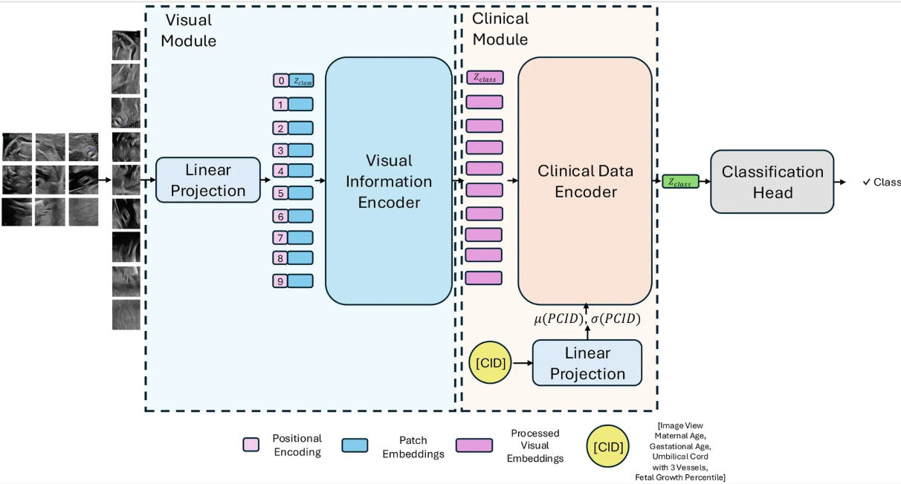
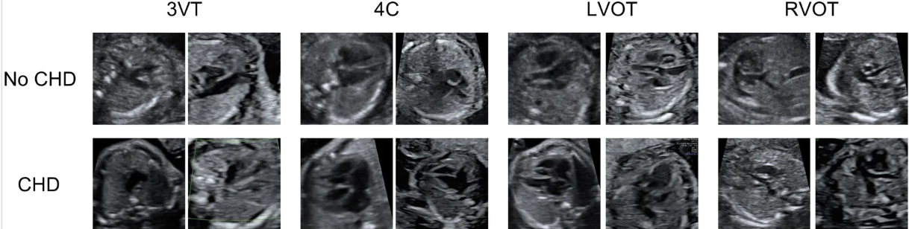

# Heartbeat: a multimodal dataset of fetal echocardiography and clinical metadata for early detection of congenital heart disease

Detection of congenital heart disease (CHD) from fetal echocardiography, using a Vision
Transformer conditioned on clinical data.



A **visual module**, ViT-B/16 over all of a patient's views, and a **clinical module**
that conditions the encoder on `[image view, maternal age, gestational age, umbilical
cord with 3 vessels, fetal growth percentile]` through AdaNorm.

## Results

### Second trimester

Second-trimester held-out test set, mean ± standard deviation over the four folds. Each
fold applies the decision threshold selected on its cross-validation split.

| model | sensitivity | specificity | PPV | AUROC | F1 |
|---|---|---|---|---|---|
| MobileNet v2 | 29.17 ± 25.00 | 87.73 ± 7.62 | 15.30 ± 11.87 | 82.73 ± 5.06 | 19.90 ± 15.98 |
| VGG16 | 62.50 ± 15.96 | 88.64 ± 6.86 | 41.28 ± 12.77 | 85.46 ± 2.98 | 47.48 ± 5.02 |
| ResNet18 | 66.67 ± 23.57 | 87.73 ± 4.78 | 37.30 ± 4.89 | 86.44 ± 4.32 | 46.67 ± 9.03 |
| ResNet50 | 75.00 ± 9.62 | 85.46 ± 4.92 | 37.45 ± 8.60 | 85.53 ± 2.48 | 49.22 ± 6.23 |
| ViT-Base | 70.84 ± 8.33 | 88.64 ± 5.01 | 42.70 ± 11.13 | 85.83 ± 2.73 | 52.40 ± 7.97 |
| **Heart-ViT (ours)** | **79.17 ± 8.33** | **93.18 ± 2.29** | **56.95 ± 6.99** | **88.56 ± 3.80** | **65.63 ± 2.09** |

### Second versus third trimester

The study is a second-trimester one; the third-trimester images were run as a
cross-validation comparison only, for Heart-ViT. Mean ± standard deviation of F1 over
the four folds:

| cohort | fold 1 | fold 2 | fold 3 | fold 4 | F1 |
|---|---|---|---|---|---|
| 2nd trimester | 52.17 | 71.43 | 60.00 | 66.67 | 62.57 ± 8.37 |
| 3rd trimester | 72.00 | 66.67 | 66.67 | 66.67 | **68.00 ± 2.67** |

These are **cross-validation** numbers, as the third trimester has no test split.

To see how to reproduce these results go to [Reproducing the results](#reproducing-the-results).

## The data



The dataset has four standard views: **3VT** (three-vessel), **4C** (four-chamber),
**LVOT** and **RVOT** (left and right ventricular outflow tracts).

| split | images | patients | CHD patients |
|---|---|---|---|
| 2T cross-validation | 2,938 | 723 | 44 |
| 2T test | 341 | 61 | 6 |
| 3T cross-validation | 2,936 | 690 | 50 |

Classification is per patient: a patient's images are scored individually and their probabilities averaged.

## Setup

### 1. Environment

```bash
git clone https://github.com/BCV-Uniandes/Heartbeat.git
cd Heartbeat
conda create -n heartbeat python=3.11.4
conda activate heartbeat
pip install -r requirements.txt
```

### 2. Dataset and checkpoints

Both are available through the
[**access request form**](https://forms.gle/QTTn1S7kKxkepVB18), which verifies institutional or educational
affiliation before granting download permission. The dataset is distributed exclusively
for academic and research purposes. Approved requests receive the download links by
email.

Three archives. Take the dataset plus whichever models you need. The checkpoints are
split so that reproducing Heart-ViT does not require downloading the baselines:

| archive | size | contents |
|---|---|---|
| `heartbeat-dataset.tar` | 2.1 GB | 6,215 images and their metadata, all three splits |
| `heartbeat-checkpoints-heart-vit.tar.gz` | 3.2 GB | Heart-ViT, both trimesters, 4 folds each |
| `heartbeat-checkpoints-baselines.tar.gz` | 3.6 GB | ViT, ResNet-18/50, VGG-16, MobileNet, 2T, 4 folds each |

Unpack all of them into `Heartbeat/`. The archives carry their own top-level directory,
so the paths land where the scripts expect:

```bash
tar -xf  heartbeat-dataset.tar
tar -xzf heartbeat-checkpoints-heart-vit.tar.gz
tar -xzf heartbeat-checkpoints-baselines.tar.gz
```

The result:

```
Heartbeat/
  dataset/
    2T/cross_val/   2,938 images, 723 patients, fold1..4.csv, metadata
    2T/test/          341 images,  61 patients
    3T/cross_val/   2,936 images, 690 patients, fold1..4.csv, metadata
  checkpoints/
    2T/<arch>/<arch>_fold_<1..4>.pth
    3T/heart-vit/heart-vit_fold_<1..4>.pth
```


## Final Layout

```
Heartbeat/
  run_train.py            train one fold
  run_eval.py             score one checkpoint on one split
  dataloader/             per-image and per-patient datasets, transforms
  evaluation/             inference, prediction files
  metrics/                threshold sweep and the five reported metrics
  models/                 backbone, Heart-ViT, baselines, build()
  training/               engine, class-balanced loss, helpers
  utils/
  scripts/train/<cohort>/ the training runs
         /test/<cohort>/  the evaluations
```

## Reproducing the results

There are three scripts, split by cohort and model family. To reproduce all the published results run:

```bash
bash scripts/test/2T/heart-vit.sh    #  8 runs: 2T cross-validation and test
bash scripts/test/2T/baselines.sh    # 40 runs: five baselines, 2T
bash scripts/test/3T/heart-vit.sh    #  4 runs: 3T cross-validation
```

Each script is a configuration block, one `run_fold` function, and one line per fold
with the hyperparameters in columns. To run a subset, comment out lines; to add a fold,
copy one.

Output lands in `logs/eval/<cohort>/<arch>/<split>/fold_<n>/`:

```
logs/eval/2T/heart-vit/test/fold_1/
  predictions.json    per patient: label, prob_chd, and every image's two scores
  test.log            per-patient progress, then the metrics at the applied threshold
```

A log reads:

```
[heart-vit 2T test 1] 61 patients from .../Heartbeat/dataset/2T/test
[heart-vit 2T test 1] [   1/61] P0017  images  1  label 0  prob_chd 0.0127
[heart-vit 2T test 1] [   2/61] P0037  images  2  label 0  prob_chd 0.0000
...
[heart-vit 2T test 1] threshold 0.4400 (fixed)
[heart-vit 2T test 1] f1 0.6667  sensitivity 0.8333  specificity 0.9273  ppv 0.5556  auroc 0.8939
```

Each script runs its folds one after another on a single device, `DEVICE=0` by default.
With more than one GPU, run the three scripts at the same time, one per device:

```bash
DEVICE=0 bash scripts/test/2T/heart-vit.sh &
DEVICE=1 bash scripts/test/2T/baselines.sh &
DEVICE=2 bash scripts/test/3T/heart-vit.sh &
wait
```

`PYTHON=/path/to/python` overrides the interpreter, and passing a directory as the first
argument overrides where the output goes.

## Training

```bash
bash scripts/train/2T/heart-vit.sh
bash scripts/train/2T/baselines.sh
bash scripts/train/3T/heart-vit.sh
```

A run writes to `logs/train/<cohort>/<arch>/<split>/fold_<n>/`, the same shape
as the evaluation logs:

```
logs/train/2T/heart-vit/cross_val/fold_1/
  train.log               config, then one timestamped line per epoch, best marked
  run.json                the resolved configuration and every epoch's metrics
  best_predictions.json   the validation predictions at the selected epoch
  ckpt/best.pth           the selected epoch's weights, loadable by run_eval.py --ckpt
  ckpt/last.pth           optimiser state and RNG streams, to resume an interrupted run
```

## Contact

If you have any questions about the code, the data, or anything else in this repository, feel free to reach out! s.rodriguezr2@uniandes.edu.co

## Citation

```bash 
@ARTICLE{
Rodriguez2026Heartbeat,
AUTHOR={Rodríguez, Santiago  and Pérez, Alejandra  and Echeverry, Lina Marcela  and Castillo, Ángela  and Ramírez, Nataly Alejandra  and Escobar, María  and Guarín Monroy, Sofía  and Vega, Daniela  and Rodríguez, Nicolás  and Castro-Páez, Camila  and Navarro, Javier  and Domínguez, María Teresa  and Laverde, Nicolás  and Sarmiento, Luis Andrés  and Afanador, Daniel  and D'silva Londoño, Liz  and Torres Narváez, Erika  and Fandiño, María Juliana  and Madrid, Antonio José  and Quintero, Juan Carlos  and Rodríguez, Nadiezhda  and Briceño, Juan Carlos  and Arbeláez, Pablo },
TITLE={Heartbeat: a multimodal dataset of fetal echocardiography and clinical metadata for early detection of congenital heart disease},
JOURNAL={Frontiers in Cardiovascular Medicine},
VOLUME={Volume 13 - 2026},
YEAR={2026},
URL={https://www.frontiersin.org/journals/cardiovascular-medicine/articles/10.3389/fcvm.2026.1726484},
DOI={10.3389/fcvm.2026.1726484},
ISSN={2297-055X}
}
```
